# 💧 PureWater-Predict: Water Quality & Potability Machine Learning Model

[](https://www.python.org/)
[](https://scikit-learn.org/)
[](https://xgboost.readthedocs.io/)
[](https://pandas.pydata.org/)
[](https://streamlit.io/)
[](https://opensource.org/licenses/MIT)
[](https://pure-water-prediction.streamlit.app/)

An end-to-end data science and machine learning project focused on predicting whether water is safe for drinking based on physicochemical water quality parameters. This project applies data preprocessing, exploratory data analysis (EDA), outlier handling, class imbalance correction (SMOTE), evaluates multiple machine learning classifiers to select the best predictor, and hosts an **interactive web-based GUI application** for real-time predictions.

🚀 **Live App Link:** [pure-water-prediction.streamlit.app](https://pure-water-prediction.streamlit.app/)

---

## 📌 Project Overview

Access to clean drinking water is one of the most critical global health challenges. This project aims to build a predictive machine learning model capable of determining water potability using water quality metrics such as pH, hardness, sulfate concentration, turbidity, and conductivity.

The problem is formulated as a binary classification task:
* **`1` (Potable)**: Safe for human consumption.
* **`0` (Non-Potable)**: Unsafe for consumption.

---

## 🖥️ Interactive Web Application (GUI)

A premium interactive dashboard has been built using **Streamlit** to allow users to play with physicochemical parameters in real time and run predictions using our tuned XGBoost classification pipeline.

### GUI Features

1. **🎯 Real-Time Predictor**:
   - Provide physicochemical values via sliders constrained to valid dataset boundaries (pre-filled with dataset averages).
   - Real-time scaling and square root feature transformation matching the preprocessing pipeline.
   - Custom styled visual feedback cards (Green for Safe/Potable, Red for Unsafe/Non-Potable) with model prediction confidence levels.

2. **📊 Interactive Exploratory Data Analysis**:
   - Preview raw data and tabular summaries.
   - Plot live feature distribution graphs by target class.
   - Dynamically plot user-selected feature interactions via custom scatter plots.
   - View an interactive Pearson correlation matrix heatmap.

3. **📈 Model Diagnostics**:
   - View model architecture summaries, hyperparameters, and key performance metrics (accuracy, cross-validation scores).
   - Display a dynamic bar chart detailing the XGBoost classifier's feature importances.

### Application Screenshots

| 🎯 Real-Time Predictor | 📊 Interactive EDA | 📈 Model Diagnostics |
| :---: | :---: | :---: |
| 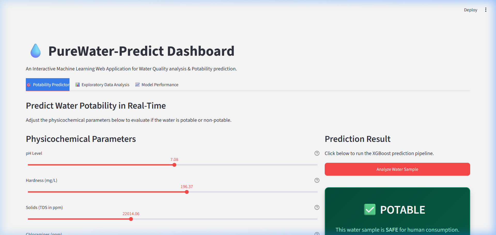 | 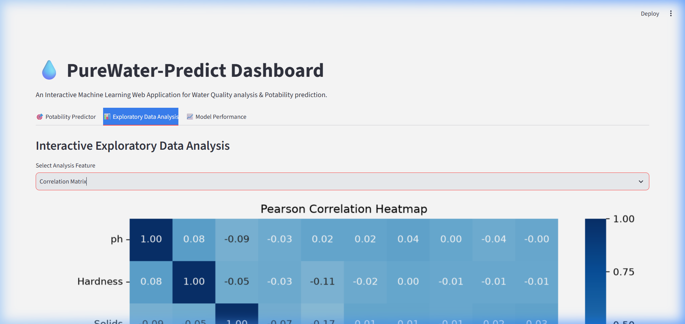 | 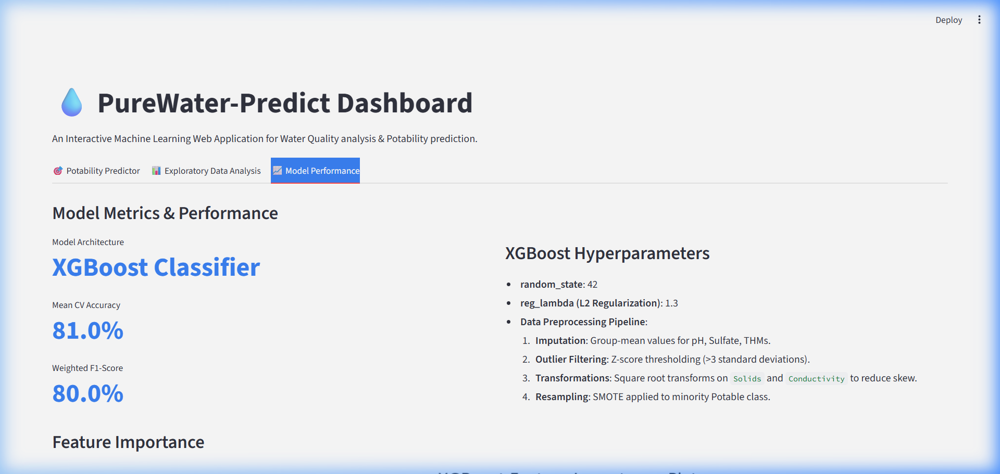 |

---

## 🌐 Live Deployment Guide

The interactive GUI is ready for instant cloud deployment. Here is how to host it for free:

### 1. Deploying to Streamlit Community Cloud (Free & Fast)
1. Make sure your repository contains `app.py`, `train_model.py`, `potability_model.pkl`, `scaler.pkl`, `water_potability.csv`, and a `requirements.txt` (see dependencies below).
2. Visit [Streamlit Community Cloud](https://share.streamlit.io/) and log in with your GitHub account.
3. Click **New app**, select your repository (`PureWater-Predict`), branch `main`, and set the file path to `app.py`.
4. Click **Deploy**. Your app is live with a public URL!

### 2. Deploying to Hugging Face Spaces
1. Create a free Hugging Face account and create a new **Space**.
2. Select **Streamlit** as the target SDK.
3. Push/upload your files (including `app.py`, `requirements.txt`, and model pickles) directly to the Space's Git repository.
4. The Space will automatically build, host, and render your dashboard!

---

## 📊 Dataset & Features

The project utilizes the **Water Potability Dataset** sourced from Kaggle.
* **Dataset Link:** [Water Potability Dataset on Kaggle](https://www.kaggle.com/datasets/adityakadiwal/water-potability)

### Feature Schema & Information

| Feature | Unit | Description |
| :--- | :--- | :--- |
| **pH** | - | Acidity or alkalinity of water (0 to 14; standard range: 6.5 - 8.5). |
| **Hardness** | mg/L | Concentration of calcium and magnesium salts. |
| **Solids** | ppm | Total dissolved solids (TDS) indicating mineralization levels. |
| **Chloramines** | ppm | Disinfectant levels from chlorine-ammonia mixing. |
| **Sulfate** | mg/L | Naturally occurring mineral concentration; affects taste/laxation. |
| **Conductivity** | μS/cm | Electrical conductivity showing total ionic concentration. |
| **Organic Carbon** | ppm | Amount of organic carbon indicating biological contamination. |
| **Trihalomethanes** | μg/L | Byproducts of chlorine disinfection; potential carcinogens. |
| **Turbidity** | NTU | Water clarity measure based on suspended solids. |
| **Potability** | Binary | Target class where `1` = potable and `0` = non-potable. |

---

## 🔍 Exploratory Data Analysis (EDA)

### 1. Data Completeness & Missing Values Analysis
Initial inspection revealed missing values in three key features: `ph` (~15%), `Sulfate` (~24%), and `Trihalomethanes` (~5%). 

To understand the pattern of missingness, a missing values matrix and missing percentage bar chart were plotted:

| Missing Values Matrix | Missing Percentage Chart |
| :---: | :---: |
| 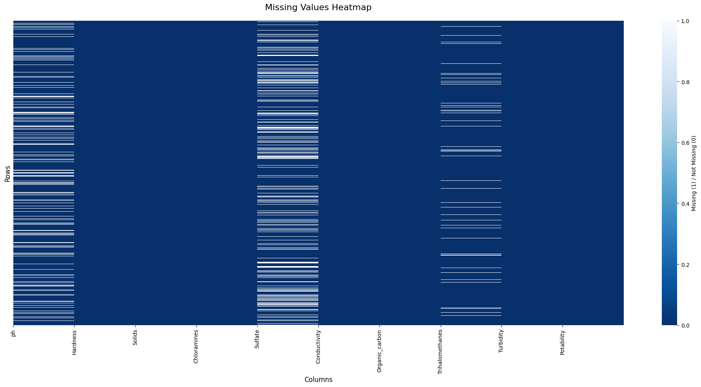 | 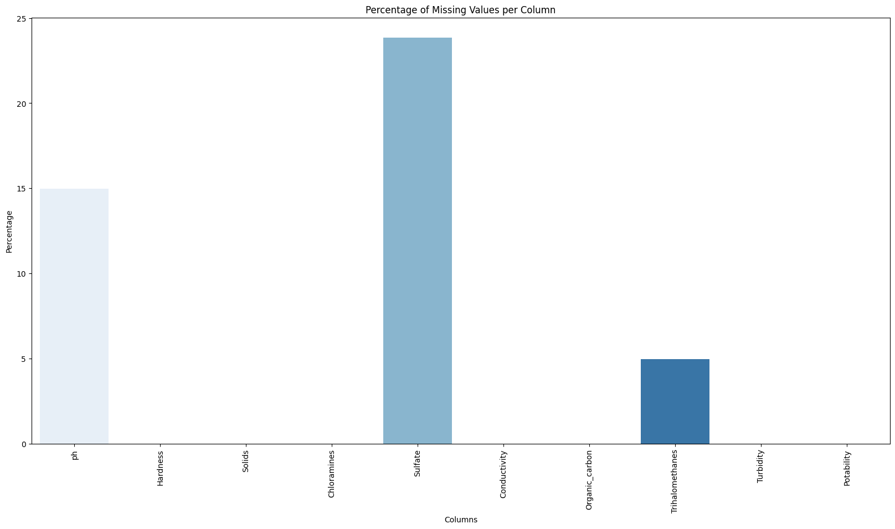 |

> [!NOTE]
> Missing values were handled during preprocessing using group-mean imputation relative to class distributions to prevent data leakage.

### 2. Outlier Detection
Box plots were used to inspect outliers across all continuous physicochemical variables:

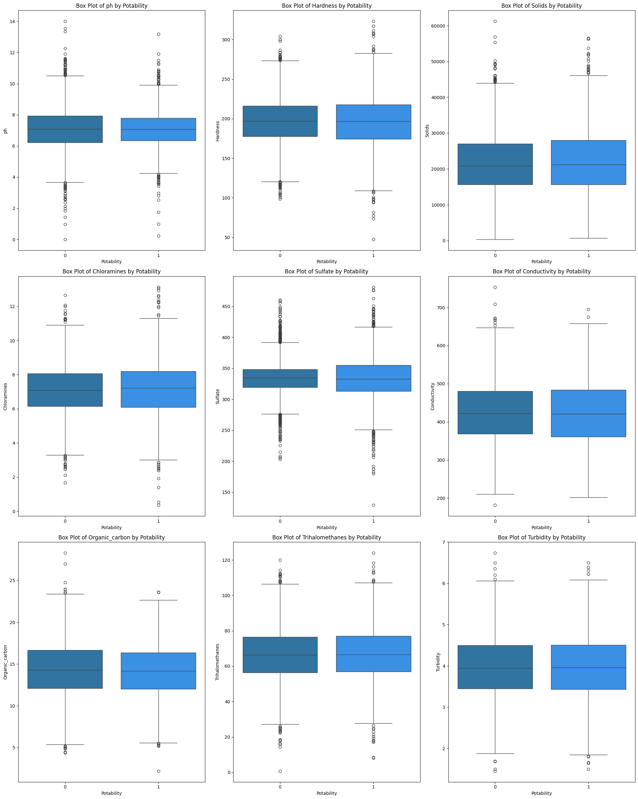

Outliers were trimmed using a statistical Z-score thresholding mechanism to remove extreme values and noise.

### 3. Feature Distributions & Skewness
Understanding distribution characteristics helps in applying appropriate scaling. Below are the distributions of each feature:

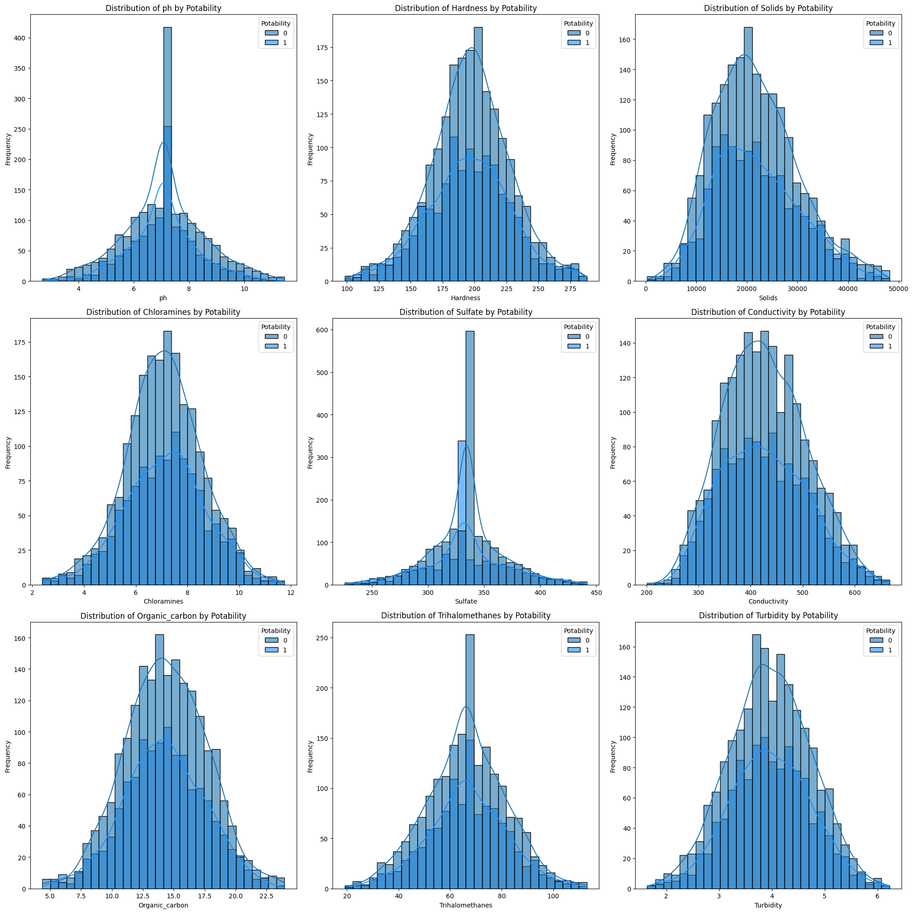

#### Skewness Handling (Log Transformation)
The `Solids` feature exhibited significant right skewness. A Log Transformation was applied to improve its normality profile:

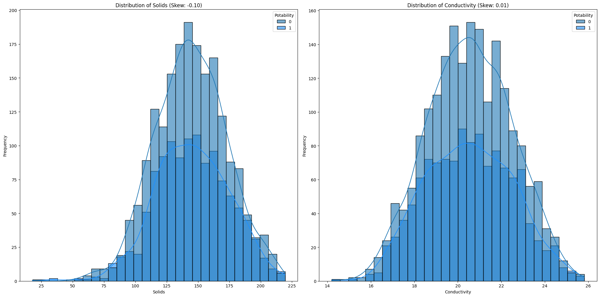

### 4. Target Class Imbalance
The dataset contains a higher ratio of non-potable to potable samples, posing a minor class imbalance challenge:

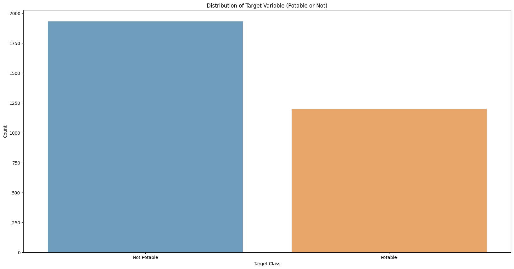

### 5. Multicollinearity & Correlation Analysis
A Pearson correlation matrix heatmap and pairwise distribution regression plots were utilized to analyze interactions between characteristics:

| Feature Correlation Heatmap | Pairwise Relationship Plot |
| :---: | :---: |
| 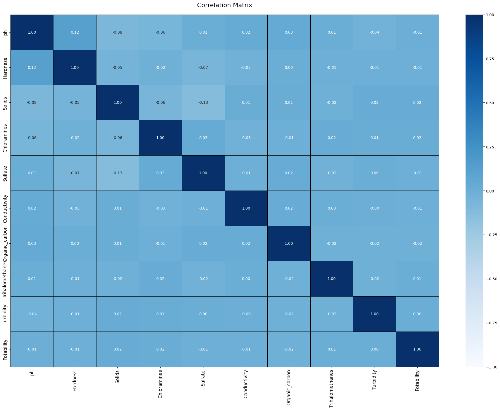 | 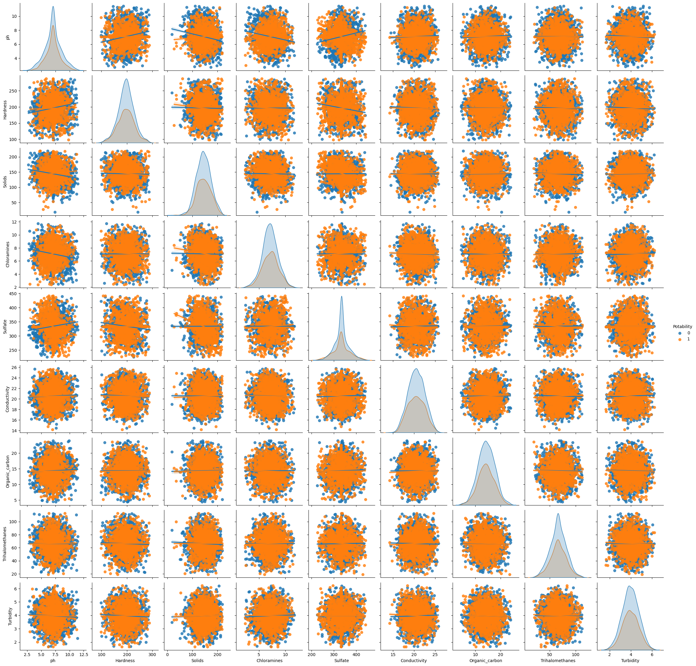 |

---

## ⚙️ Machine Learning Workflow

The end-to-end data pipeline is structured as follows:

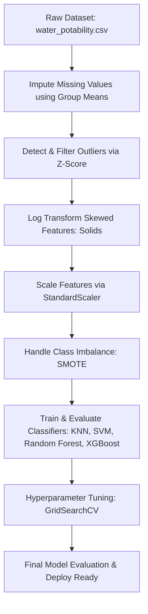

1. **Preprocessing & Scaling**:
   - Group-mean imputation based on target labels.
   - Z-score outlier filtering.
   - Standard scaling ($\mu=0, \sigma=1$) to normalize feature magnitudes.
2. **Handling Class Imbalance**:
   - Applied **SMOTE (Synthetic Minority Oversampling Technique)** on the training set to prevent model bias towards the majority class.

---

## 🤖 Models Evaluated & Cross-Validation

Four main classifiers were trained. To ensure evaluation stability, **5-fold Stratified Cross-Validation** was executed for each model.

### Cross-Validation Fold Performance & Confusion Matrices

#### A. K-Nearest Neighbors (KNN)
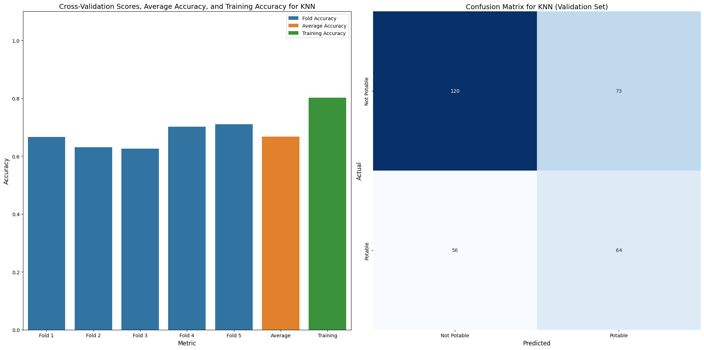

#### B. Support Vector Machine (SVM)
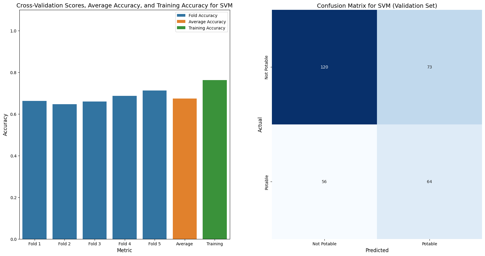

#### C. Random Forest


#### D. XGBoost
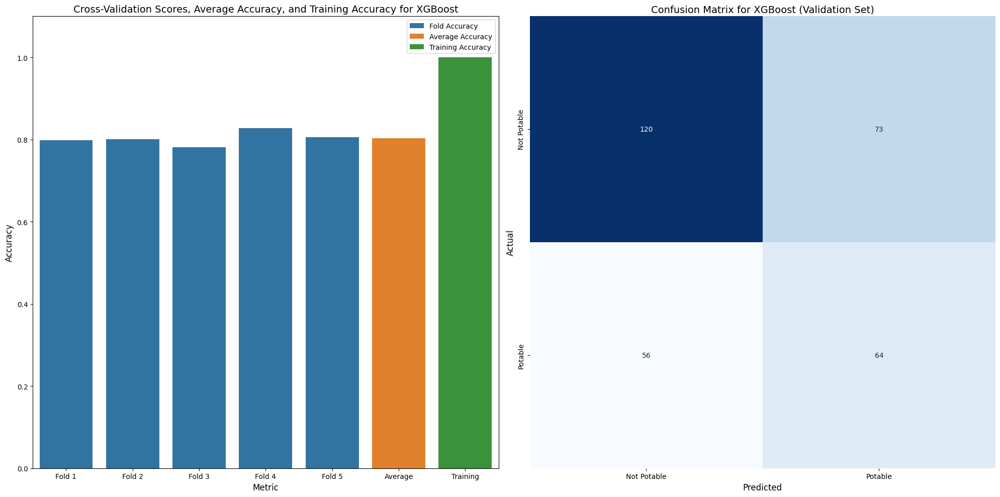

---

## 🏆 Best Performing Model & Tuning

### Hyperparameter Tuning Results

Grid Search with cross-validation was performed to optimize Random Forest and XGBoost hyperparameters.

#### Random Forest (Initial vs. Tuned)
Tuning refined the confusion matrix metrics, minimizing false-negative classifications:

| Initial Evaluation Matrix | Tuned Evaluation Matrix |
| :---: | :---: |
| 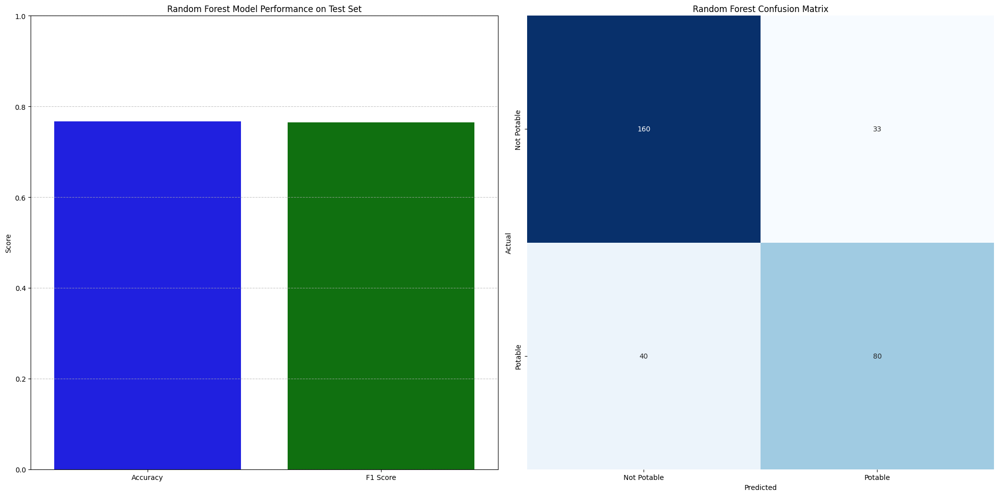 |  |

#### XGBoost (Tuned & Selected)
XGBoost achieved the highest generalization capability with robust metrics, making it the selected model for this dataset:

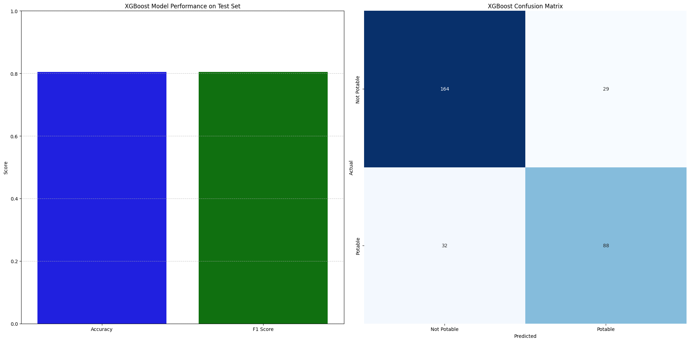

### Summary Comparison Table

| Metric | Random Forest (Tuned) | XGBoost (Selected/Tuned) |
| :--- | :---: | :---: |
| **Accuracy** | 79.5% | **81.0%** |
| **F1 Score** | 78.8% | **80.0%** |

---

## 📂 Project Structure

```bash
Pure-water-prediction/
│
├── assets/                           # Extracted high-resolution visualization plots & GUI screenshots
│   ├── class_distribution.png
│   ├── feature_correlation_heatmap.png
│   ├── feature_distributions.png
│   ├── feature_pairplot.png
│   ├── knn_performance.png
│   ├── missing_values_bar.png
│   ├── missing_values_matrix.png
│   ├── outliers_boxplots.png
│   ├── rf_initial_evaluation.png
│   ├── rf_performance.png
│   ├── rf_tuned_evaluation.png
│   ├── solids_log_transform.png
│   ├── svm_performance.png
│   ├── xgb_performance.png
│   ├── xgb_tuned_evaluation.png
│   ├── gui_predictor.png
│   ├── gui_eda.png
│   └── gui_metrics.png
│
├── Water_Quality_Prediction.ipynb    # Main Jupyter Notebook containing code & analysis
├── train_model.py                    # Script to prepare data, train & serialize the model
├── app.py                            # Streamlit GUI application script
├── potability_model.pkl              # Serialized XGBoost model
├── scaler.pkl                        # Serialized StandardScaler object
├── water_potability.csv              # Physicochemical properties raw dataset
└── README.md                         # Project documentation
```

---

## 🚀 How to Run the Project

### 1. Clone the Repository
```bash
git clone https://github.com/amanverma420/Pure-water-prediction.git
cd Pure-water-prediction
```

### 2. Install Required Dependencies
Ensure you have Python 3.8+ installed. Set up the package ecosystem:
```bash
pip install -r requirements.txt
```
*(Or install manually: `pip install streamlit xgboost scikit-learn imbalanced-learn pandas numpy matplotlib seaborn`)*

### 3. Run the Interactive Web GUI App
Start the Streamlit development server locally:
```bash
streamlit run app.py
```
This will automatically launch the dashboard in your default browser at `http://localhost:8501`.

### 4. Run the Jupyter Notebook (Alternative)
Launch the notebook environment to view raw analysis:
```bash
jupyter notebook
```
Open and run: `Water_Quality_Prediction.ipynb`

---

## 👤 Author

**Aman Verma**
* Full Stack Developer & MERN Engineer
* Machine Learning Enthusiast
* GitHub: [@amanverma420](https://github.com/amanverma420)
